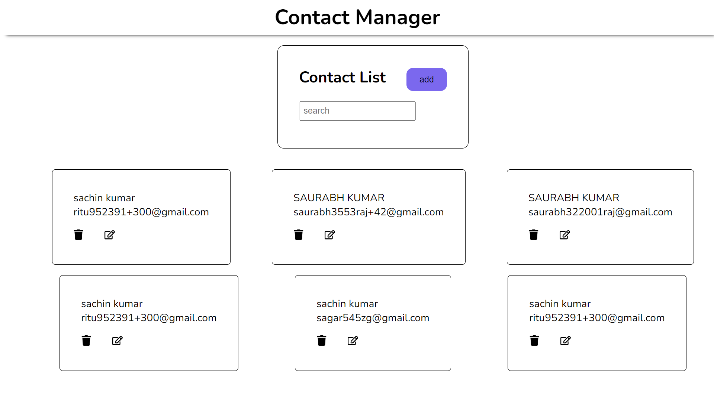

# Contact Manager web app with backed data and api

<<<<<<< HEAD
Live Preview - [Click Here](https://contact-manager-ap.netlify.app/)

 

  

 
 

# 🛠 Installation and Setup Instructions

Clone down this repository. You will need node.js and git installed globally on your machine..

Installation: `npm install`

In the project directory, you can run: `npm start`

Runs the app in the development mode.\
Open [http://localhost:3000](http://localhost:3000) to view it in the browser.

## Contribute

Pull Requests are welcome. :)

## Show your support

Give a ⭐ if you like this website!
=======
## Live prereview (https://contact-manager-ap.netlify.app/)

https://raw.githubusercontent.com/saurabh-kud/Contact-app/main/public/mokup.png
>>>>>>> aecd4f0b69e9cdef61ae30ae467a03667035ff37
